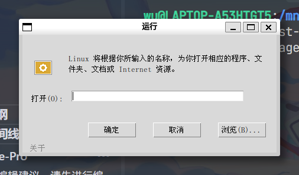

# Run For Linux

[](https://www.python.org/)
[](https://github.com/)
[](https://docs.python.org/3/library/tkinter.html)
[](LICENSE)
[]()

> Linux / Windows / macOS 上的 Win+R 风格运行对话框

---

## ✨ 项目简介

**Run For Linux** 是一个跨平台的「运行」对话框工具，复刻了 Windows 系统中 `Win + R` 快捷键打开的运行窗口。你可以用它快速打开程序、文件夹、文档或 Internet 资源，让 Linux 和 macOS 用户也能享受到同样便捷的操作体验。

## 🎯 功能特性

- ⌨️ **全局热键呼出** — `Win + R`（Windows）/ `Super + R`（Linux）快速唤起
- 🖥️ **跨平台支持** — 兼容 Windows、Linux、macOS、FreeBSD
- 📂 **文件浏览** — 内置「浏览」按钮，快速选择要打开的文件
- 🚀 **一键启动** — 输入命令或路径，回车即可执行
- 🎨 **原生界面** — 基于 Tkinter，风格简洁，与系统无缝融合
- 🔧 **轻巧无负担** — 纯 Python 实现，无需复杂依赖

## 📦 环境要求

| 依赖 | 说明 |
|------|------|
| Python | 3.6 及以上版本 |
| Tkinter | Python 内置 GUI 库（Linux 需手动安装） |
| Pillow | 图像处理库，用于加载图标 |
| keyboard | 全局热键监听库 |

## 🚀 快速开始

### 1. 克隆项目

```bash
git clone https://gitee.com/windowsuninstaller/RunForLinux.git
cd RunForLinux
```

### 2. 安装依赖

#### Linux 系统（一键脚本）

```bash
bash ./安装依赖并创建venv.sh
```

#### Windows 系统（手动安装依赖）
```batch
# 安装 Python 依赖
py -m pip install keyboard pillow
```

#### 手动安装（通用）

```bash
# Linux 需先安装系统级依赖
sudo apt install python3-tk python3-pil python3-pil.imagetk python3-venv

# 创建虚拟环境
python3 -m venv .venv
source .venv/bin/activate    # Linux / macOS
# .venv\Scripts\activate     # Windows

# 安装 Python 依赖
pip install keyboard pillow
```

### 3. 运行程序

#### 启动热键监听（常驻后台）

```bash
# Linux / macOS
chmod +x run.sh
nohup bash ./run.sh &

# 或 Windows
start NOCMD.exe "python main.py"
```

#### 仅单次打开运行对话框

```bash
python runapp.py
```

## 📖 使用说明

1. **呼出对话框**：按下 `Win + R`（Windows）或 `Super + R`（Linux/macOS）
2. **输入内容**：在「打开」输入框中键入：
   - 程序名称（如 `notepad`、`gnome-terminal`）
   - 文件路径（如 `C:\Users\`、`/home/user/Documents`）
   - 网址（如 `https://www.example.com`）
3. **执行**：点击「确定」或按 `Enter` 键
4. **浏览文件**：点击「浏览...」按钮手动选择文件
5. **关闭**：点击「取消」或按 `Esc` 键

## 📁 项目结构

```
RunForLinux/
├── main.py                    # 主程序入口（热键监听）
├── runapp.py                  # 运行对话框 GUI 实现
├── run.sh                     # Linux/macOS 启动脚本
├── 安装依赖并创建venv.sh       # Linux 一键安装脚本
├── 运行_00001.ico             # 窗口图标
├── LICENSE                    # MIT 许可证
├── README.md                  # 中文说明文档
└── README.en.md               # 英文说明文档
```

## 💻 项目运行效果


## 🛠️ 技术栈

- **GUI 框架**：[Tkinter](https://docs.python.org/3/library/tkinter.html) — Python 标准库，跨平台轻量级 GUI
- **图像处理**：[Pillow](https://python-pillow.org/) — 图标加载与显示
- **全局热键**：[keyboard](https://github.com/boppreh/keyboard) — 跨平台键盘事件监听
- **系统调用**：`subprocess` / `os.system` — 跨平台命令执行

## 📄 许可证

本项目基于 [MIT License](LICENSE) 开源，欢迎自由使用、修改和分发。

